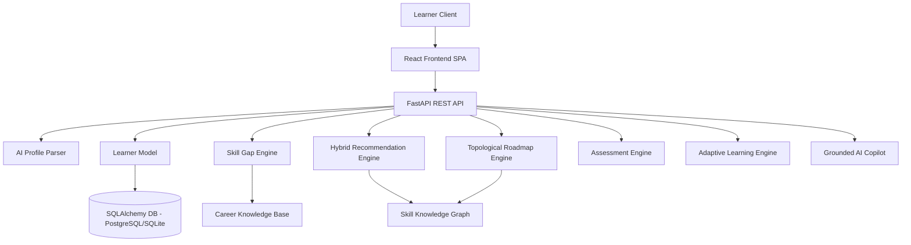

# PATHFINDER AI

## AI-Powered Personalized Career & Learning Path Recommender

> **PathFinder doesn't just recommend courses. It understands where a learner is, where they want to go, and continuously builds the path between them.**

---

## Problem

Learners in technology and data fields face severe information overload:
- **Overwhelming Resource Supply**: Access to thousands of courses, tutorials, and documentation but zero clarity on what to learn first.
- **Unclear Skill Gaps**: Inability to identify exact missing competencies required for target career roles.
- **Flawed Prerequisite Sequences**: Attempting advanced topics (e.g. Deep Learning) before mastering mandatory foundations (e.g. Linear Algebra, NumPy).
- **Static, One-Size-Fits-All Platforms**: Generic course platforms recommend identical video lists regardless of prior experience, available hours, or assessment performance.

Traditional platforms recommend **courses**. Learners need a **path**.

---

## Solution

PathFinder AI is an intelligent career navigation and adaptive learning SaaS system. It transforms natural-language learner ambitions, existing skills, and time constraints into an explainable, prerequisite-aware, and continuously adaptive learning roadmap.

```text
CURRENT STATE ──► CAREER GOAL ──► SKILL GAPS ──► PREREQUISITE GRAPH ──► ROADMAP ──► ASSESS & ADAPT ──► NEXT ACTION
```

---

## Key Features

### 1. AI Profile Understanding
Extracts structured skills, proficiency levels, target roles, time budgets, and learning preferences from natural-language onboarding conversations.

### 2. Skill Gap Intelligence
Deterministically compares learner capabilities against 6 career knowledge specifications to classify skills into `MASTERED`, `DEVELOPING`, `MISSING`, `LOCKED`, and `RECOMMENDED`.

### 3. Career Readiness Score
Calculates an interpretable, transparent readiness metric based on mastered skills, developing contributions, and satisfied prerequisites.

### 4. Prerequisite-Aware Roadmap
Applies Directed Acyclic Graph (DAG) topological sorting across 40+ skills to guarantee mandatory prerequisites are completed before advanced topics.

### 5. Hybrid Recommendation Engine
Multi-factor weighted scoring algorithm combining skill gap relevance, career importance, prerequisite readiness, difficulty fit, learning preference, time budget, and historical feedback.

### 6. Explainable Recommendations ("Why This?")
Every milestone provides transparent contextual reasoning explaining why the topic was selected based on career goals and prerequisite readiness.

### 7. Next Best Action
Prominently spotlights the single highest-leverage activity (Resource, Project, or Assessment) the learner should execute right now.

### 8. Adaptive Learning Engine
Micro-assessments and 5-tier confidence feedback (`Struggling`, `Need Practice`, `Comfortable`, `Confident`, `Too Easy`) automatically update the learner model and re-rank the roadmap.

### 9. What-if Career Simulator
Allows learners to evaluate prospective career switches, displaying skill overlap percentage, shared skills, missing skills, and estimated additional effort weeks.

### 10. AI Career Copilot
Grounded conversational assistant answering queries (*"What should I focus on this week?"*) using live profile state.

### 11. Offline Fallback Engine
Core recommendation, skill gap analysis, readiness calculation, and roadmap topological ordering remain 100% functional even when external AI API keys are unavailable.

---

## AI/ML Architecture

PathFinder AI is **NOT** a simple ChatGPT wrapper. The LLM is strictly scoped to natural language extraction, reasoning, explanations, and conversational assistance, while structured algorithms govern skill gaps, readiness scores, and prerequisite ordering.

```
Natural Language Input ("CSE student, Python/SQL...")
        ↓
AI Profile Extraction (Layer 1)
        ↓
Learner Model State (Proficiency & Confidence)
        ↓
Career Knowledge Base + Skill Knowledge Graph (DAG)
        ↓
Skill Gap Engine (Deterministic)
        ↓
Hybrid Recommendation Engine (Weighted Scoring)
        ↓
Prerequisite-Aware Roadmap (Topological Sort)
        ↓
Assessment + Feedback Loop
        ↓
Adaptive Replanning Engine
        ↓
Next Best Action
```

> **The LLM provides natural-language understanding, reasoning, and explanations, while structured learner state, career requirements, prerequisite relationships, and deterministic recommendation logic maintain consistency, ordering, and explainability.**

---

## Hybrid Recommendation Methodology

Candidate skills $S_i$ are ranked using a multi-factor weighted scoring model:

$$\text{Score}(S_i) = \sum_{k=1}^7 W_k \cdot F_k(S_i)$$

- **30% Skill Gap Relevance**: Prioritizes developing or recommended target gaps.
- **20% Career Relevance**: Weight assigned to skill in career specification.
- **15% Prerequisite Readiness**: Fraction of prerequisite dependencies satisfied.
- **10% Difficulty Fit**: Alignment with learner experience level.
- **10% Learning Preference**: Match with preferred medium (Project Based, Video, Reading).
- **10% Time Fit**: Fits within weekly hour budget.
- **5% Progress / Feedback**: Dynamic adjustments from historical assessments.

---

## Career Readiness Formula

$$\text{Readiness} = \left(0.5 \times \text{Mastered Ratio} + 0.3 \times \text{Developing Ratio} + 0.2 \times \text{Prerequisite Completion}\right) \times 100$$

*Note: The score is an interpretable estimate of learning readiness, NOT an employment probability or salary guarantee.*

---

## Adaptive Learning Loop

```text
LEARN ──► ASSESS ──► FEEDBACK ──► UPDATE LEARNER MODEL ──► RECALCULATE GAPS ──► RE-RANK ROADMAP
```

- **Assessment Score $\ge 85\%$ or Feedback "Too Easy"**: Marks skill as `MASTERED`, accelerates path to next phase.
- **Assessment Score $< 70\%$ or Feedback "Struggling" / "Need Practice"**: Marks skill as `DEVELOPING`, inserts remediation step in roadmap.

---

## System Architecture



---

## Tech Stack

- **Frontend**: React 18, TypeScript, Vite, Tailwind CSS, `@xyflow/react` (React Flow), Recharts, Framer Motion, TanStack React Query, React Router DOM v6.
- **Backend**: Python 3.10+, FastAPI, Pydantic v2, SQLAlchemy 2.0, Uvicorn.
- **Database**: SQLite (local zero-config) / Supabase PostgreSQL.
- **AI/ML Layer**: Unified LLM Client (`backend/ai/llm_client.py`) supporting OpenAI / Gemini + `OfflineFallbackEngine`.
- **Testing**: FastAPI TestClient suite (`backend/test_api.py`).

---

## HCL Requirement Traceability

| HCL Requirement | PathFinder AI Implementation | Location |
|---|---|---|
| Conversational interface | Layer 1 NLP Profile Parser & Onboarding | [OnboardingPage.tsx](file:///d:/HCL%20AMPLIFIED/frontend/src/pages/OnboardingPage.tsx) |
| Learner profiling | Live Learner Model (Proficiency & Confidence) | [skill_gap_engine.py](file:///d:/HCL%20AMPLIFIED/backend/services/skill_gap_engine.py) |
| Career objectives & Skill gaps | Deterministic Skill Gap Classification | [SkillGapBadge.tsx](file:///d:/HCL%20AMPLIFIED/frontend/src/components/SkillGapBadge.tsx) |
| Prerequisite-aware roadmap | DAG Topological Sorting into 5 Phases | [roadmap_engine.py](file:///d:/HCL%20AMPLIFIED/backend/services/roadmap_engine.py) |
| Resource & Project recommendation | Hybrid Scoring Recommender | [recommendation_engine.py](file:///d:/HCL%20AMPLIFIED/backend/services/recommendation_engine.py) |
| Assessments & Feedback | Micro-Assessments & 5-tier Feedback Loop | [adaptive_engine.py](file:///d:/HCL%20AMPLIFIED/backend/services/adaptive_engine.py) |
| Explainable recommendations | "Why This?" Prerequisite Reasoning | [WhyThisModal.tsx](file:///d:/HCL%20AMPLIFIED/frontend/src/components/WhyThisModal.tsx) |
| Adaptive replanning | Real-time Roadmap Topological Re-ranking | [RoadmapPage.tsx](file:///d:/HCL%20AMPLIFIED/frontend/src/pages/RoadmapPage.tsx) |
| Conversational AI assistant | Grounded RAG-Lite AI Copilot | [CopilotPage.tsx](file:///d:/HCL%20AMPLIFIED/frontend/src/pages/CopilotPage.tsx) |
| Career readiness visualization | Semi-circle Gauge & Skill Growth Curve | [ReadinessGauge.tsx](file:///d:/HCL%20AMPLIFIED/frontend/src/components/ReadinessGauge.tsx) |

---

## Project Structure

```text
pathfinder-ai/
├── README.md
├── docker-compose.yml
├── requirements.txt
├── .env.example
├── .gitignore
├── backend/
│   ├── main.py
│   ├── config.py
│   ├── test_api.py
│   ├── database/
│   │   ├── session.py
│   │   └── base.py
│   ├── models/
│   │   └── domain.py
│   ├── schemas/
│   │   └── pydantic_models.py
│   ├── seed/
│   │   ├── seed_data.py
│   │   └── seed_loader.py
│   ├── ai/
│   │   ├── llm_client.py
│   │   └── fallback_engine.py
│   ├── services/
│   │   ├── skill_gap_engine.py
│   │   ├── readiness_engine.py
│   │   ├── recommendation_engine.py
│   │   ├── roadmap_engine.py
│   │   ├── adaptive_engine.py
│   │   ├── simulator_engine.py
│   │   └── copilot_engine.py
│   └── api/
│       ├── profile_router.py
│       ├── career_router.py
│       ├── roadmap_router.py
│       ├── skill_router.py
│       ├── assessment_router.py
│       ├── chat_router.py
│       └── dashboard_router.py
├── frontend/
│   ├── package.json
│   ├── vite.config.ts
│   ├── tsconfig.json
│   ├── tailwind.config.js
│   ├── index.html
│   └── src/
│       ├── main.tsx
│       ├── App.tsx
│       ├── types/
│       ├── services/
│       ├── context/
│       ├── components/
│       └── pages/
└── docs/
    ├── architecture.md
    ├── ai-architecture.md
    ├── recommendation-engine.md
    └── demo-guide.md
```

---

## Local Setup & Quickstart

### 1. Clone Repository
```bash
git clone https://github.com/your-username/pathfinder-ai.git
cd pathfinder-ai
```

### 2. Backend Setup
```bash
# Create virtual environment
python -m venv .venv

# Activate on Windows
.venv\Scripts\activate

# Install dependencies
pip install -r requirements.txt

# Configure environment
cp .env.example .env

# Run FastAPI backend server
python -m backend.main
```
Backend will start on `http://localhost:8000`.

### 3. Frontend Setup
```bash
cd frontend
npm install
npm run dev
```
Frontend will start on `http://localhost:3000`.

---

## Verification & Testing

### Backend API Verification Test
Run the automated backend test suite covering all 11 core endpoints:
```bash
$env:PYTHONPATH="."
python -m backend.test_api
```
*Result: 11/11 tests pass.*

### Frontend Production Build Test
Verify TypeScript compilation and Vite build:
```bash
cd frontend
npm run build
```
*Result: Clean compilation with 0 errors.*

---

## Demo Flow

For a 3–5 minute hackathon demonstration, follow the exact guide in [docs/demo-guide.md](file:///d:/HCL%20AMPLIFIED/docs/demo-guide.md).

---

## Future Scope

- **Real-Time Labor Market Integration**: Ingest real-time job posting APIs (LinkedIn, Indeed) to auto-update career skill weights.
- **GitHub Repository Analysis**: Automatically parse learner GitHub repositories to verify project evidence.
- **Institutional Analytics Dashboard**: Provide university and enterprise administrators with cohort skill gap visualizations.
