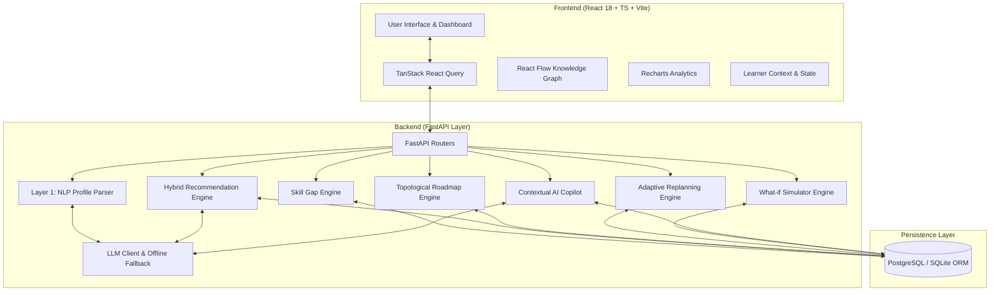

# PATHFINDER AI — System Architecture

## High-Level Architecture Overview

PathFinder AI follows a modular, decoupled full-stack architecture designed for maximum performance, determinism, and reliability.

---

## Technical Component Breakdown

### 1. Frontend Layer
- **Framework**: React 18, TypeScript, Vite.
- **Styling**: Vanilla Tailwind CSS v3 with sleek SaaS color palette (`#FAFAFA` neutral, `#FFFFFF` surfaces, `#4F46E5` indigo accent).
- **Knowledge Graph**: `@xyflow/react` for rendering prerequisite DAGs.
- **Analytics & Readiness**: `recharts` for semi-circle readiness gauges and skill growth curves.
- **State & Server Sync**: `@tanstack/react-query` for API caching and pessimistic background invalidation.

### 2. Backend API & Service Layer
- **Framework**: FastAPI (Python 3.10+) with Pydantic v2 validation.
- **Deterministic Services**:
  - `SkillGapEngine`: Deterministically calculates skill status (`MASTERED`, `DEVELOPING`, `MISSING`, `LOCKED`, `RECOMMENDED`).
  - `ReadinessEngine`: Computes $0.5 \times \text{Mastered} + 0.3 \times \text{Developing} + 0.2 \times \text{Prerequisite Completion}$.
  - `TopologicalRoadmapEngine`: Performs DAG topological sorting on missing skills respecting prerequisite edges.
  - `AdaptiveLearningEngine`: Re-evaluates gaps upon assessment submission or 5-tier confidence feedback.
  - `SimulatorEngine`: Computes skill overlap % and transition timelines.
- **AI Integration**:
  - `LLMClient`: Unified LLM wrapper supporting OpenAI / Gemini with structured Pydantic schema parsing and automatic failover to `OfflineFallbackEngine`.

### 3. Persistence & Data Layer
- **ORM**: SQLAlchemy 2.0.
- **Database**: Supabase PostgreSQL / SQLite zero-config fallback.
- **Data Models**: `User`, `LearnerProfile`, `Skill`, `Career`, `CareerSkill`, `SkillPrerequisite`, `LearnerSkill`, `Resource`, `Project`, `LearningPath`, `PathStep`, `Assessment`, `AssessmentQuestion`, `AssessmentResult`, `Feedback`, `ChatMessage`.
